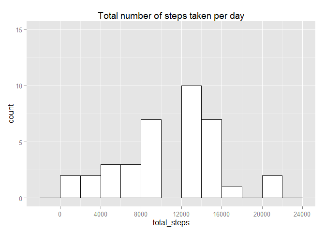
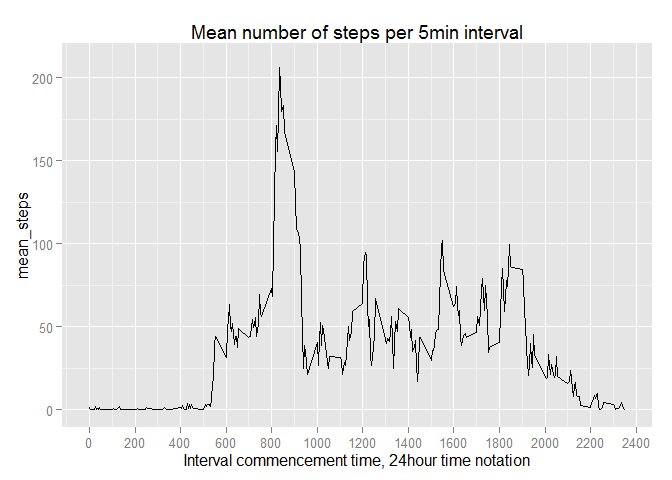
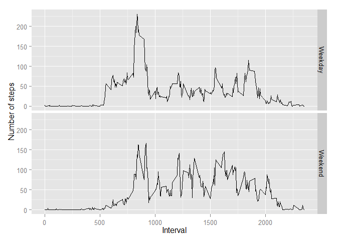

# Reproducible Research: Peer Assessment 1

##Let's first setup all the stuff we need 

```r
library(dplyr)
library(data.table)
library(ggplot2)
```

## Let's import the data and convert the dates into POSIXct format. 

```r
if(!file.exists("./data/activity.csv")){
  unzip("activity.zip", exdir = "./data")}
rawdata <- read.csv("./data/activity.csv")
data <- as.data.table(rawdata)
data$date <- as.POSIXct(data$date)
```

## What is the mean total number of steps taken per day?

```r
summarised1 <- summarise(group_by(data[!is.na(data$steps),], date), sum(steps))
setnames(summarised1,"sum(steps)","total_steps")
ggplot(summarised1, aes(x=total_steps)) + geom_histogram(binwidth=2000, colour="black", fill="white") +
  xlim(0,24000) + ylim(0,15) + ggtitle("Total number of steps taken per day") + 
  scale_x_continuous(breaks=seq(0,24000,4000))
```

 

```r
print(paste("The mean total number of steps per day is: ", mean(summarised1$total_steps)))
print(paste("The median total number of steps per day is: ", median(summarised1$total_steps)))
```

```
## [1] "The mean total number of steps per day is:  10766.1886792453"
## [1] "The median total number of steps per day is:  10765"
```

## What is the average daily activity pattern?

```r
summarised2 <- summarise(group_by(data[!is.na(data$steps),], interval), mean(steps))
setnames(summarised2,"mean(steps)","mean_steps")

ggplot(summarised2, aes(y=mean_steps, x=interval)) + geom_line() + xlim(0,2400) + ylim(0,210) + 
  ggtitle("Mean number of steps per 5min interval") + scale_x_continuous(breaks=seq(0,2400,200)) + 
      xlab("Interval commencement time, 24hour time notation")
```

 

```r
storeMaxInterval <- summarised2[summarised2$mean_steps == max(summarised2$mean_steps),interval]
print(paste("The 5min interval that, averaged across all days, contains the maximum number of steps is:", storeMaxInterval, "to", sum(storeMaxInterval,5)))
```

```
## [1] "The 5min interval that, averaged across all days, contains the maximum number of steps is: 835 to 840"
```

## Imputing missing values

```r
print(paste("The total number of missing values in the dataset is: ", table(is.na(data))[2]))
```

```
## [1] "The total number of missing values in the dataset is:  2304"
```

We will fill in for all of the missing values in the dataset, by replacing each missing value with the corresponding across-all-days mean for that 5-minute interval.


```r
cleanData <- data 

#This for loop replaces the missing values 
for (i in 1:dim(data)[1]){                #loop through each steps element
  
  if(is.na(cleanData$steps[i])){          #check if it is NA
    na_interval <- cleanData$interval[i]  #if it is NA, get its interval value
    cleanData$steps[i] <- summarised2$mean_steps[summarised2$interval == na_interval]   #replace it with the corresponding mean for that interval 
  }
}

summarised3 <- summarise(group_by(cleanData, date), sum(steps))
setnames(summarised3,"sum(steps)","total_steps")

ggplot(summarised3, aes(x=total_steps)) + geom_histogram(binwidth=2000, colour="black", fill="white") +
  xlim(0,24000) + ylim(0,15) + ggtitle("Total number of steps taken per day") + 
  scale_x_continuous(breaks=seq(0,24000,4000))
```

 

```r
print(paste("The mean total number of steps per day is: ", mean(summarised3$total_steps)))
print(paste("The median total number of steps per day is: ", median(summarised3$total_steps)))
```

```
## [1] "The mean total number of steps per day is:  10766.1886792453"
## [1] "The median total number of steps per day is:  10766.1886792453"
```
We see that the mean calculated in this part is the same as what we calculated in the first part of the assignment.
However, the calculated median is now different and is equal to the mean. 

The original data set is such that those days which have NAs don't have any other observed values at all. So, there are NAs for every single 5min interval in that day. By imputing missing data, we have effectively taken each day that contained NAs and replaced it with a day that looks like the 'typical' or 'average' day. 

By definition, the average day has a total number of steps that is equal to the dataset's average, and such a day will show up around the middle of the dataset, when laid out along the dimension of total steps per day. By substituting in a number of such average days into the dataset (via the process of imputing missing values), there are now a large number of these days around the middle of the dataset, and the median along this dimension is found to be on one such day. This is why the median now is the same as the mean.


## Are there differences in activity patterns between weekdays and weekends?

```r
dayData <- mutate(cleanData,weekday = weekdays(date))
dayData$weekday[(grep("Saturday|Sunday", dayData$weekday, invert=T))] <- 1
dayData$weekday[(grep("Saturday|Sunday", dayData$weekday))] <- 0 
dayData$weekday <- factor(dayData$weekday)

dayData_wd <- subset(dayData, weekday == 1)
dayData_we <- subset(dayData, weekday == 0)

summarised_wd <- summarise(group_by(dayData_wd, interval), mean(steps))
setnames(summarised_wd,"mean(steps)","mean_steps")
summarised_wd <- mutate(summarised_wd, weekday = "Weekday")

summarised_we <- summarise(group_by(dayData_we, interval), mean(steps))
setnames(summarised_we,"mean(steps)","mean_steps")
summarised_we <- mutate(summarised_we, weekday = "Weekend")

dayData <- rbind(summarised_we, summarised_wd)

qplot(interval, mean_steps, data=dayData, geom="line", xlab = "Interval", ylab = "Number of steps", facets = weekday ~ . )
```

 
